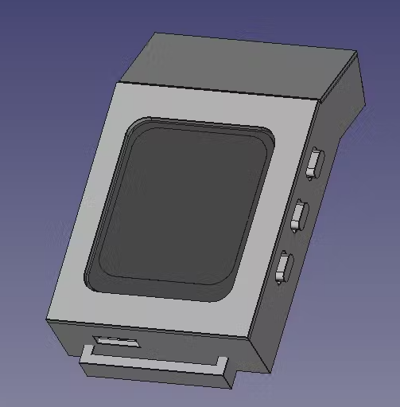
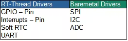
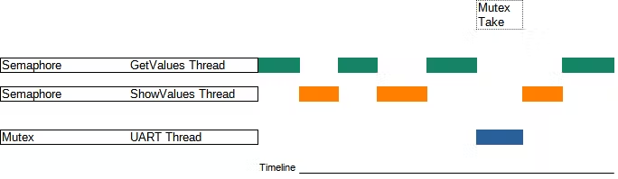

# CH32V307-Smartwatch
My entry on Hack It! RISC-V Design Challenge.

## Overview
My main goal for this "SmartWatch" project was to learn a RTOS (such as RT-Thread) and make a functional clock with at least one feature involving Bluetooth low energy (BLE). 

For the baremetal drivers I used the examples of the CH32V307 github page: https://github.com/openwch/ch32v307
Here is a list of the baremetal drivers and RT-thread device drivers I ended up using.

I structured my threads the simplest way possible, my objective here was to use 2 Thread synchronization methods and 3 threads.

## Hardware

All the available hardware (Schematic, Layout and BOM files) is available at: https://oshwlab.com/yvanox/smartwatch-ch32v307_copy
