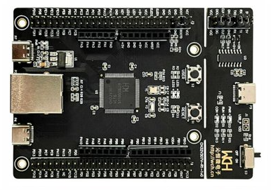

# CH32V307V-R1 Development board BSP Instructions

## Introduction

The main contents are as follows：

- Introduction to development board resources
- Get started quickly with BSP
- Advanced usage

By reading the Quick Start chapter, developers can quickly get started with the BSP and run RT-Thread on the development board. In the Advanced User Guide chapter, more advanced functions will be introduced to help developers use RT-Thread to drive more onboard resources.

## Development board introduction

is a development board based on RISC-V core launched by Nanjing Qinheng Microelectronics (WCH). The highest frequency is 120Mhz. The chip of this development board is CH32V307-R1.

The appearance of the development board is shown in the following figure:



The commonly used onboard are as follows:

- MCU: CH32V307VCT6, main frequency 144MHz, four configurations of FLASH and RAM:
  288KB FLASH ，32KB RAM
  256KB FLASH ，64KB RAM
  224KB FLASH ，96KB RAM
  192KB FLASH ，128KB RAM
  
- Common peripherals
  - LEDs: 2 user LEDs.
  - LED: power LED, D1.
  - Buttons, 2, Reset adn User.
  - USB, 3, Type-C.
  - Ethernet port, 1, built-in 10M PHY

For more details about the development board, please refer to the official WCH [Development Board Introduction] EVT Package->PUB->CH32V307 Evaluation Board Instructions.pdf ( http://www.wch.cn/downloads/CH32V307EVT_ZIP.html).

## Peripheral support

The current BSP support for peripherals is as follows:

| **On-Chip Peripherals** | **Support ** | **Remarks ** |
| GPIO                    |     支持        | PA PB PC PD PE         |
| UART                    |     支持        | UART0/1/2/3/4/5/6/7/8  |
| SDIO                    |     即将支持    |                        |
| ADC                     |     支持        | 10bit ADC1/2           |
| DAC                     |     支持        | 10bit DAC channel 1/2  |
| ETH                     |     支持        | 10M                    |
| SPI                     |   即将支持       |                       |
| I2C                     |     即将支持     |                       |
| RTC                     |     即将支持     |                       |
| WDT                     |     即将支持     |                       |
| FLASH                   |   即将支持       |                       |
| TIMER                   |     即将支持     |                       |
| PWM                     |     即将支持     |                       |
| USB Device              |   即将支持       |                       |
| USB Host                |   即将支持       |                       |

## Instructions for use

The instructions for use are divided into the following two chapters:

- Get started quickly

This chapter is an instruction manual for those who are new to RT-Thread. Follow the simple steps to run the RT-Thread operating system on the development board and see the experimental results.

- Advanced use

This chapter is for developers who need to use more board resources on RT-Thread OS. By using the ENV tool to configure the BSP, more onboard resources can be turned on and more advanced functions can be realized.


### Get started quickly

This BSP provides GCC development environment for developers. The following describes how to run the system.

#### hardware connection

Use the data cable to connect the development board to the PC, and turn on the power switch.

#### Compile and download

Get the firmware through `RT-Thread Studio` or compile, download through `scons` `.dcf` 固件，`Downloader`

#### operation result

After downloading the program successfully, the system will automatically run, observe the running effect of the LED on the development board, and the red LED will flash periodically.

Connect the corresponding serial port of the development board to the PC, open the corresponding serial port (115200-8-1-N) in the terminal tool, after resetting the device, you can see the output information of RT-Thread:

```bash
 \ | /
- RT -     Thread Operating System
 / | \     4.0.4 build Sep  1 2021
 2006 - 2021 Copyright by rt-thread team
adc1 init successdacc1 init success

 MCU: CH32V307

 SysClk: 144000000Hz

 www.wch.cn

msh >
```
### Advanced use

This BSP only enables the functions of GPIO and serial port 1 by default. If you need to use more advanced functions such as ETH and ADC, you need to use the ENV tool to configure the BSP. The steps are as follows:

1. Open the env tool under bsp.

2. Enter `menuconfig` the command to configure the project, save and exit after the configuration is complete.

3. Enter `pkgs --update` the command to update the package.

4. Enter `scons` the command to recompile the project.

## Precautions

The baud rate is 115200Kbps by default, the programming code needs to go to our official website ( http://www.wch.cn/downloads/WCHISPTool_Setup_exe.html) to download the ISP tool for programming, and the later version will support our WCH-Link-Two Online SWD download.

